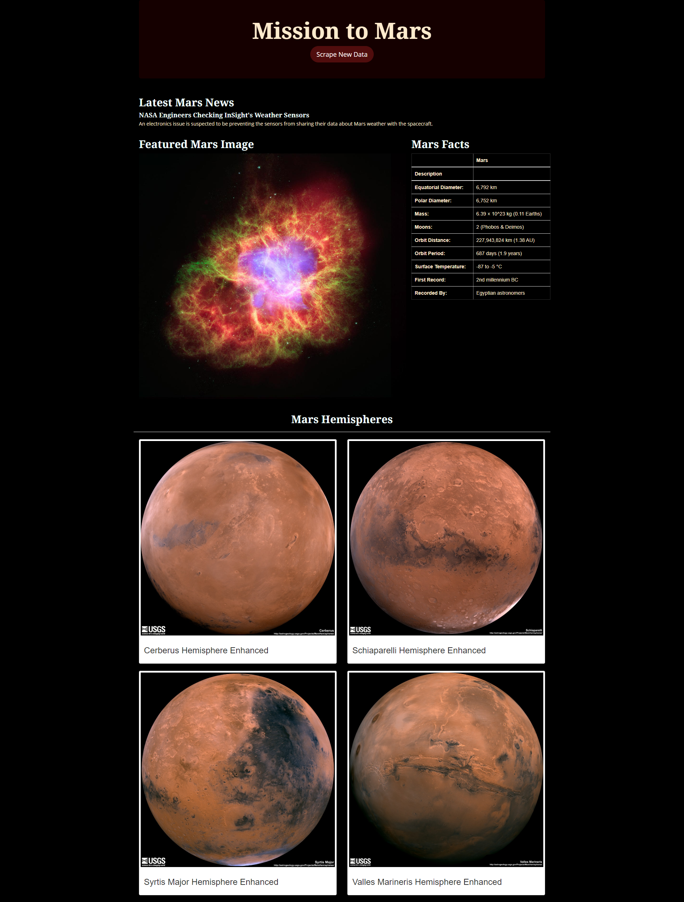

# Mission to Mars

## Background
Build a web application that scrapes data from Nasa website re;ated to Mission to Mars and displays the information in a html page.

## Result
### Step 1 - Scraping
#### NASA Mars News 
Go to NASA News website(url = 'https://mars.nasa.gov/news/') and scrape the latest News Title and Paragraph Text.

#### Mars Space Images 
Visit NASA space image website(url = 'https://www.jpl.nasa.gov/spaceimages/?search=&category=Mars') and utilize Splinter to navigate the NASA website and look for the full resolution featured images urls. 
Beautiful soup is also used for parsing the website.

#### Mars Facts
Visit NASA space facts website(url='https://space-facts.com/mars/') and utilize pandas to scrape the facts table into a dataframe. Dataframe is then converted into html format and bootstrap is added.

#### Mars Hemispheres
Visit the USGS Astrogeology site(url = 'https://astrogeology.usgs.gov/search/results?q=hemisphere+enhanced&k1=target&v1=Mars') to obtain high resolution images with their title for each of Mar's hemispheres. 
imgage url and title are added into a dictionary called "hemispheres" for each hemisphere. and then each dictionary is added into a list called 
hemisphere_image_urls.

### Step 2 - MongoDB and Flask Application
Use MongoDB with Flask templating to create a new HTML page that displays all of the scraped information in previous step.
Jupyter Notebook is converted intoa Python scrip named scraping.py with a function called scrape_all that will run all scraping function and store results in a dictionary.
In app.py, use flask_pymongo to set up mongo connection.
A root route is created to query the Mongo database and pass the mars data into the html template to show the data.
Route called /scraping is created to import scrapping.py script and call the scrape function.
A template HTML file called index.html is created to take the mars data dictionary and show all of the data in the appropriate HTML elements

 

